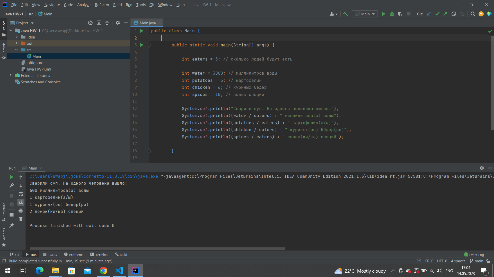

# Описание 
На выходе программа не указывает в одинаковых порциях куриных бёдер(без округлений)
# Локация дефекта 
_______________________  
# Шаги Воспроизведения
1. Копировать код программы в IDEA
2. Запустить программу 
3. Посмотреть на вывод в консоли. 
## Ожидаемый результат: 1.2 куриных бедра
## Фактический результат: 1 куриных бёдер
# Скриншот:

# Окружение 
* Операционная система: Windows 10
*  IDA: IntelliJ IDEA 2021.1.3 (community Edition) 